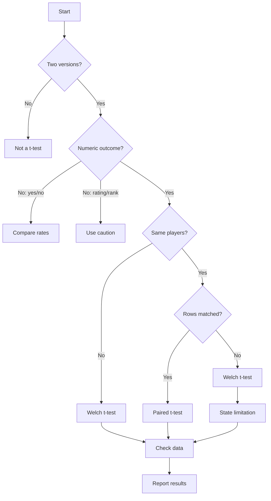

# Student's t-test for A/B Analysis

<div style="background-color: #f3f0eb; border-left: 6px solid #b8afa3; padding: 1rem 1.25rem; border-radius: 0.5rem; margin: 1rem 0 1.5rem 0;">

<h2 style="margin-top: 0;">Key Concepts</h2>

<p>Before choosing a t-test, make sure you can name the variables in your A/B comparison.</p>

<ul>
  <li><strong>Independent variable:</strong> the thing your team changed between Version A and Version B, such as objective markers, enemy damage, puzzle clue wording, tutorial prompts, lighting, or feedback effects.</li>
  <li><strong>Dependent variable:</strong> the thing you measured to judge whether the change mattered, such as completion time, deaths, hints used, score, confidence rating, or frustration rating.</li>
  <li><strong>Null hypothesis:</strong> the assumption that Version A and Version B do not differ in the measured outcome.</li>
  <li><strong>Alternative hypothesis:</strong> the claim that Version A and Version B differ in the measured outcome.</li>
  <li><strong>p-value:</strong> how surprising your observed difference would be if the null hypothesis were true.</li>
  <li><strong>Statistical significance:</strong> usually reported when <em>p</em> &lt; .05, but it should still be interpreted alongside the effect size, confidence interval, plots, and confounds.</li>
  <li><strong>Effect size:</strong> how large the difference is in practical terms. In game testing, a small p-value is less useful than knowing whether the change made the game meaningfully clearer, faster, fairer, or less frustrating.</li>
</ul>

<p><strong>Simple rule:</strong> use the t-test to support a gameplay argument, not to replace judgement. Your report still needs summary statistics, a plot, a confidence interval, and an honest discussion of limitations.</p>

</div>

## Introduction

In your GCA lab report, you are comparing two versions of your game or two testing conditions.

This is often called an **A/B test**:

| Version | Meaning |
| :- | :- |
| **A** | The original build, setting, mechanic, level design, UI, tutorial, or tuning value. |
| **B** | The revised build, setting, mechanic, level design, UI, tutorial, or tuning value. |

A Student's t-test helps you answer this question:

> Is the difference between Version A and Version B large enough that it is unlikely to be explained by random variation alone?

In game development terms, a t-test can help you investigate questions such as:

- Did the new objective marker change completion time?
- Did the revised tutorial change player confidence?
- Did lowering enemy damage change player deaths?
- Did adding interactable-object highlights change the number of missed interactions?
- Did a revised puzzle clue change the time taken to solve the puzzle?

A t-test does **not** prove that your design change caused the result. It provides evidence that the measured difference between A and B may be meaningful.

## Assumption for these notes

These notes assume that you have already cleaned your dataset.

That means you should already have:

- one row per playtest session or participant result;
- a column identifying the build or condition, such as `build`;
- a numeric dependent variable, such as `completion_time_sec`;
- no impossible values in the variable you are testing;
- missing values handled and documented;
- exclusions already recorded in your Methodology or Data Analysis section.

The main notes therefore focus on **choosing the correct t-test, running it, and reporting it clearly**. Longer setup and source-code examples are provided in the appendix.

## Where this fits in your lab report

Your t-test belongs in the **Data Analysis** and **Results** sections of your report.

| Report section | What to include |
| :- | :- |
| **Introduction** | State your hypothesis in plain English. |
| **Methodology** | Describe Version A, Version B, the independent variable, and the dependent variable. |
| **Data Analysis** | State which t-test you used and why. |
| **Results** | Report the means, mean difference, t-test result, p-value, effect size, and confidence interval. |
| **Discussion** | Interpret the finding in gameplay terms and acknowledge confounds. |

A t-test should support your argument. It should not replace your visualisation, summary statistics, confidence interval, or discussion of limitations.

## Which test should I choose?

Use the flowchart below before you run a t-test. The most important question is whether your data can genuinely match each player's Version A result with the same player's Version B result.



Use the short labels in the chart as follows:

| Chart label | Meaning |
| :- | :- |
| **Two versions?** | A t-test is for comparing two groups or conditions. If you have more than two, do not use a t-test as your main method. |
| **Numeric outcome?** | A t-test compares means, so the dependent variable should be numeric, such as time, score, distance, deaths, or hints used. |
| **Compare rates** | If the outcome is completed/not completed, compare completion rates instead of using a t-test as the main test. |
| **Use caution** | If the outcome is a 1-5 or 1-7 rating, you may summarise and compare cautiously, but say that the result is indicative. |
| **Same players?** | Decide whether the same participants tested both A and B. |
| **Rows matched?** | Decide whether each player's A result can be matched with the same player's B result using an anonymous participant ID. |
| **Welch t-test** | Use when A and B are independent groups, or when the pairing information has been lost. |
| **Paired t-test** | Use only when the same players tested both versions and the rows can be matched. |
| **State limitation** | Say that the same players tested both versions but participant IDs were not recorded, so the paired analysis could not be used. |
| **Check data** | Inspect plots, missing values, outliers, sample size, and confounds before interpreting the p-value. |
| **Report results** | Report group means, mean difference, 95% CI, p-value, effect size, plot, and gameplay interpretation. |

## A practical game example

Imagine a team has created a 3D exploration game where players must find a keycard and escape a ruined facility.

During Stage 4 testing, the team wants to test whether adding an **objective marker** changed how long players took to complete the level.

| Element | Example |
| :- | :- |
| **Version A** | No objective marker. Players rely only on environmental clues. |
| **Version B** | Objective marker appears when the player is lost for more than 30 seconds. |
| **Independent variable** | Objective marker absent vs present. |
| **Dependent variable** | Completion time in seconds. |
| **Research question** | Did the objective marker change completion time? |
| **H0** | Mean completion time is the same in Version A and Version B. |
| **H1** | Mean completion time is different between Version A and Version B. |

This is a suitable case for a t-test because:

- there are two groups: A and B;
- the dependent variable is numeric: completion time in seconds;
- the team wants to compare the mean completion time between the two versions.

## Which t-test should you use?

There are three common versions you might encounter.

| Situation | Test to use | R setting |
| :- | :- | :- |
| Different players tested A and B | **Welch independent samples t-test** | `t.test(y ~ group, data = df)` |
| Same players tested A and B, and each A result can be matched to the same player's B result | **Paired samples t-test** | `t.test(before, after, paired = TRUE)` |
| Same players tested A and B, but you did **not** record participant IDs or cannot match A results to B results | **Welch independent samples t-test as an approximation** | `t.test(y ~ group, data = df)` |
| Different players tested A and B and you are certain variances are equal | Student independent samples t-test | `t.test(y ~ group, data = df, var.equal = TRUE)` |

For most student A/B playtests, use **Welch's independent samples t-test** when different testers played Version A and Version B.

Welch's t-test is usually safer because it does not assume that the two groups have equal variance.

A paired t-test is only possible when the data contains the pairing information. In practice, this means each participant needs an anonymous ID such as `P01`, `P02`, or `P03`, and the dataset must show which A result and which B result came from the same person.

## What does p < .05 mean?

A common threshold for statistical significance is:

> p < .05

This means:

> If there were really no difference between A and B, a result this large would be relatively unlikely under the assumptions of the test.

It does **not** mean:

- there is a 95% chance that B is better;
- the design change definitely caused the result;
- the result is important in gameplay terms;
- the study was free from bias or confounds.

Statistical significance should always be interpreted alongside:

- the mean difference;
- the confidence interval;
- the plot;
- the sample size;
- the effect size;
- the confounds in the testing session.

## Main workflow in R

Assume you already have a cleaned data frame called `test_df` with these columns:

| Column | Example | Meaning |
| :- | :- | :- |
| `build` | A or B | Which version the player tested. |
| `completion_time_sec` | 184 | Time taken to complete the level. |

The main example below uses:

- `build` as the independent variable;
- `completion_time_sec` as the dependent variable.

## Create a small practice dataset

If you are working with your own cleaned spreadsheet, you can skip this short setup and use your own data frame.

If you want to run the example exactly as written, first create the small practice data frame below. This gives you a cleaned dataset called `test_df`, with one row per player session.

```r
# Practice Stage 4 A/B test data
# Scenario: Build B added an objective marker.

test_df <- data.frame(
  player_id = paste0("P", sprintf("%03d", 1:24)),
  build = rep(c("A", "B"), each = 12),
  completion_time_sec = c(
    221, 198, 244, 210, 233, 187, 256, 229, 205, 238, 216, 247,
    176, 162, 190, 181, 169, 201, 158, 174, 186, 193, 167, 179
  ),
  deaths_total = c(
    4, 3, 5, 3, 4, 2, 6, 4, 3, 5, 4, 5,
    3, 2, 3, 2, 2, 4, 1, 2, 3, 3, 2, 2
  ),
  confusion_1to7 = c(
    6, 5, 6, 5, 6, 4, 7, 6, 5, 6, 5, 6,
    4, 3, 4, 3, 3, 5, 2, 3, 4, 4, 3, 3
  )
)

# Make sure the groups are ordered as A then B.
test_df$build <- factor(test_df$build, levels = c("A", "B"))

# Quick check.
print(head(test_df))
print(table(test_df$build))
```

## Step 1: Produce a summary table

Before running a t-test, summarise the data.

```r
summary_tbl <- aggregate(
  completion_time_sec ~ build,
  data = test_df,
  FUN = function(x) c(
    n = length(x),
    mean = mean(x),
    median = median(x),
    sd = sd(x),
    min = min(x),
    max = max(x)
  )
)

summary_tbl <- do.call(
  data.frame,
  summary_tbl
)

names(summary_tbl) <- c(
  "build",
  "n",
  "mean_time_sec",
  "median_time_sec",
  "sd_time_sec",
  "min_time_sec",
  "max_time_sec"
)

summary_tbl[, -1] <- round(summary_tbl[, -1], 1)

print(summary_tbl)
```

A useful result might look like this:

| build | n | mean_time_sec | median_time_sec | sd_time_sec |
| :- | :- | :- | :- | :- |
| A | 12 | 223.7 | 225.0 | 21.3 |
| B | 12 | 178.0 | 177.5 | 13.1 |

This already tells a gameplay story:

> Players completed the level faster in Build B than in Build A.

The t-test helps you judge whether that observed difference is statistically convincing.

## Step 2: Plot the difference using base R

Always visualise the data before interpreting a t-test.

```r
boxplot(
  completion_time_sec ~ build,
  data = test_df,
  main = "Completion Time by Build",
  xlab = "Build",
  ylab = "Completion time (seconds)"
)

stripchart(
  completion_time_sec ~ build,
  data = test_df,
  vertical = TRUE,
  method = "jitter",
  pch = 16,
  add = TRUE
)
```

In your report, write 2-4 sentences under the figure.

Example:

> Figure 1 compares completion time for Build A and Build B. Build B appears to have lower completion times overall, with most values below the centre of the Build A distribution. This supports the possibility that the objective marker improved navigation and reduced time spent searching for the next objective.

## Step 3: Run Welch's independent samples t-test

Use this when different players tested Version A and Version B.

```r
welch_result <- t.test(
  completion_time_sec ~ build,
  data = test_df,
  alternative = "two.sided"
)

print(welch_result)
```

For this module, use a **two-sided** test. It asks whether the mean completion time differs between A and B, without requiring students to justify a directional test.

Important R detail:

`t.test(y ~ group)` reports the difference using the first group minus the second group. If `build` is ordered as `A`, then `B`, the confidence interval is for:

> mean(A) - mean(B)

So a positive difference means Build A took longer than Build B.

## Step 4: Extract useful results for reporting

The printed t-test output is useful, but it is often easier to extract the key values.

```r
x_a <- test_df$completion_time_sec[test_df$build == "A"]
x_b <- test_df$completion_time_sec[test_df$build == "B"]

mean_a <- mean(x_a)
mean_b <- mean(x_b)
mean_difference_a_minus_b <- mean_a - mean_b

t_value <- unname(welch_result$statistic)
df_value <- unname(welch_result$parameter)
p_value <- welch_result$p.value
ci_low <- welch_result$conf.int[1]
ci_high <- welch_result$conf.int[2]

cat(sprintf("Mean A: %.1f seconds\n", mean_a))
cat(sprintf("Mean B: %.1f seconds\n", mean_b))
cat(sprintf("Mean difference A - B: %.1f seconds\n", mean_difference_a_minus_b))
cat(sprintf("t(%.1f) = %.2f, p = %.4f\n", df_value, t_value, p_value))
cat(sprintf("95%% CI for A - B: [%.1f, %.1f]\n", ci_low, ci_high))
```

## Step 5: Calculate effect size using Cohen's d

A p-value tells you whether the difference is statistically detectable. It does not tell you how large or important the difference is.

Cohen's d is a simple effect size for mean differences.

```r
cohens_d <- function(x_a, x_b)
{
  x_a <- x_a[!is.na(x_a)]
  x_b <- x_b[!is.na(x_b)]
  
  n_a <- length(x_a)
  n_b <- length(x_b)
  
  sd_pooled <- sqrt(
    ((n_a - 1) * var(x_a) + (n_b - 1) * var(x_b)) /
      (n_a + n_b - 2)
  )
  
  (mean(x_a) - mean(x_b)) / sd_pooled
}

d <- cohens_d(x_a, x_b)

cat(sprintf("Cohen's d: %.2f\n", d))
```

## How to write the result

Your result should:

1. state the test used;
2. report the mean for each build;
3. report the mean difference;
4. report the t-test result;
5. interpret the result in gameplay terms;
6. acknowledge at least one limitation or confound.

Example:

> A Welch independent samples t-test was used to compare completion time between Build A and Build B. Build A had a mean completion time of 223.7 seconds, while Build B had a mean completion time of 178.0 seconds. The mean difference was 45.7 seconds, with Build B being faster on average. The difference was statistically significant, t(approximately 18.5) = 6.32, p < .001, with a large effect size. This suggests that the objective marker may have reduced navigation friction and helped players complete the level more efficiently. However, the result should be interpreted cautiously because the test used a small student sample and the two groups may have differed in prior genre experience.

Do not write:

> The t-test proves that the objective marker fixed the game.

Better:

> The t-test provides evidence that completion time was lower in Build B, which is consistent with the objective marker improving navigation.

## What if the same players tested A and B, but you cannot pair the rows?

This is a common data collection problem in student playtesting.

A paired t-test needs matched observations. That means the analysis must know which Version A result belongs to which Version B result for the same participant.

A correctly paired dataset looks like this:

| player_id | time_A_sec | time_B_sec |
| :- | :- | :- |
| P001 | 221 | 176 |
| P002 | 198 | 162 |
| P003 | 244 | 190 |

In this structure, the test compares each player against themselves.

If your data only looks like this, the pairing information has been lost:

| build | completion_time_sec |
| :- | :- |
| A | 221 |
| A | 198 |
| A | 244 |
| B | 176 |
| B | 162 |
| B | 190 |

In that case, R cannot know whether the `221` second A result should be paired with `176`, `162`, or `190` seconds in B. The paired test is no longer valid because the rows cannot be matched.

### What to do instead

If the same people tested A and B, but the team did not record anonymous participant IDs, use a **Welch independent samples t-test as an approximation**.

```r
unpaired_result <- t.test(
  completion_time_sec ~ build,
  data = test_df,
  alternative = "two.sided"
)

print(unpaired_result)
```

This is not ideal, because the observations are not truly independent. The same people may have brought the same skill level, genre knowledge, hardware familiarity, and learning from Version A into Version B.

### How to write the limitation

Use wording like this:

> Although the same participants tested both builds, anonymous participant IDs were not recorded, so the Version A and Version B results could not be paired. A Welch independent samples t-test was therefore used as an approximate comparison. This is a limitation because the analysis cannot control for individual player differences or learning effects between builds.

### Why this matters

A paired t-test asks:

> Did each player change from A to B?

An unpaired t-test asks only:

> Were the A results different from the B results overall?

The unpaired analysis is weaker because it ignores individual baselines. For example, a highly skilled player may naturally be faster in both builds, while a less experienced player may naturally be slower in both builds. A paired design controls for this by comparing each player to themselves.

### How to avoid this next time

In future testing, record a simple anonymous participant ID and keep it consistent across both builds.

| player_id | build | completion_time_sec |
| :- | :- | :- |
| P001 | A | 221 |
| P001 | B | 176 |
| P002 | A | 198 |
| P002 | B | 162 |

This lets you reshape the data if needed and run a proper paired t-test.

## Paired t-test: when the same players test both versions

Sometimes the same player tests both A and B.

Example:

- each player completes the same level without the objective marker;
- then each player completes a revised version with the objective marker.

This is a **paired design** because each player provides two related measurements.

Use a paired t-test.

```r
paired_result <- t.test(
  paired_df$time_A_sec,
  paired_df$time_B_sec,
  paired = TRUE,
  alternative = "two.sided"
)

print(paired_result)
```

Write-up example:

> A paired samples t-test was used because the same players tested both versions. Completion time was lower in Version B for most players. The mean paired difference was 34.2 seconds, suggesting that players generally completed the level faster with the objective marker. However, the result may be affected by a learning effect because players had already seen the level before testing Version B.

## Important confound in paired tests: learning effect

Paired tests are statistically powerful, but they introduce a serious game-testing issue:

> Players may perform better in Version B simply because they have already learned the level from Version A.

To reduce this problem, teams can:

- counterbalance the order, with some players testing B first and others testing A first;
- use two comparable but not identical level routes;
- leave a time gap between tests;
- state the learning effect honestly as a limitation.

## Checking assumptions without overcomplicating it

You do not need a long assumptions section, but you should sanity check your data.

### 1. Check sample size per group

```r
table(test_df$build)
```

### 2. Check the distribution visually

```r
hist(
  test_df$completion_time_sec[test_df$build == "A"],
  main = "Build A completion times",
  xlab = "Completion time (seconds)"
)

hist(
  test_df$completion_time_sec[test_df$build == "B"],
  main = "Build B completion times",
  xlab = "Completion time (seconds)"
)
```

### 3. Check for outliers

```r
boxplot(
  completion_time_sec ~ build,
  data = test_df,
  main = "Outlier check for completion time",
  xlab = "Build",
  ylab = "Completion time (seconds)"
)
```

If there is an outlier, do not automatically delete it.

Ask:

- Was it a data-entry mistake?
- Did the game crash or softlock?
- Did the player stop playing and return later?
- Was it valid behaviour from a confused player?

If you exclude a value, state why.

## What if the data is not ideal?

Student playtesting data is rarely perfect. That is normal.

| Problem | What to do |
| :- | :- |
| Small sample | Use cautious language; report the plot and confidence interval. |
| Outlier | Investigate; keep it unless there is a clear reason to remove it. |
| Skewed time data | Report median/IQR as well as mean/SD. |
| Likert outcome | Treat as indicative; consider median and distribution. |
| Different testers in A and B | Acknowledge group differences as a confound. |
| Same testers in A then B | Acknowledge learning effect as a confound. |
| Same testers in A and B, but no participant IDs recorded | You cannot use a paired t-test; use Welch as an approximation and state this limitation. |
| Several changes between A and B | Do not claim the independent variable alone caused the result. |

## Applying the same pattern to another metric

The same approach can test other numeric dependent variables.

For example, if your dependent variable is total deaths:

```r
deaths_result <- t.test(
  deaths_total ~ build,
  data = test_df,
  alternative = "two.sided"
)

print(deaths_result)
```

Use caution with count data such as deaths. If many players have zero deaths, the distribution may be skewed. In that case, your plot and median may be more informative than the t-test.

## Report wording template

Use this as a template and replace the bracketed parts.

> A [Welch independent samples / paired samples] t-test was used to compare [dependent variable] between [Version A] and [Version B]. Version A had a mean [dependent variable] of [mean A], while Version B had a mean of [mean B]. The mean difference was [difference], with [Version B / Version A] being [faster / slower / higher / lower] on average. The difference [was / was not] statistically significant, t([df]) = [t], p = [p]. This suggests that [plain-English gameplay interpretation]. However, this result should be interpreted cautiously because [state confound or limitation].

## If the result is statistically significant

If p < .05, write cautiously:

> The result provides evidence of a statistically significant difference between the two builds.

Then interpret the direction:

> Build B was faster on average, which is consistent with the objective marker reducing navigation friction.

Do not overstate it:

> This proves that the objective marker caused the improvement.

## If the result is not statistically significant

If p >= .05, do not write that “nothing happened”.

Better:

> The data did not provide strong evidence of a statistically significant difference between the builds. Build B was still faster on average, but the confidence interval was wide, suggesting uncertainty due to the small sample size and variation between players.

A non-significant result may still be useful if:

- the direction is promising;
- the plot shows a practical pattern;
- qualitative comments support the design change;
- the sample was too small to detect the effect clearly.

## Common mistakes

| Mistake | Why it is a problem | Better approach |
| :- | :- | :- |
| Reporting only the p-value | Hides the size and meaning of the effect. | Report means, difference, CI, p-value, and effect size. |
| Saying “proved” | A playtest is affected by confounds. | Say “suggests”, “provides evidence”, or “is consistent with”. |
| Ignoring the plot | Outliers or skew may invalidate a simple mean comparison. | Include a boxplot or histogram. |
| Testing every metric | Increases chance of false positives. | Pick one primary dependent variable. |
| Using a t-test for completion yes/no | Binary data is not a mean-based continuous outcome. | Report completion-rate difference and CI. |
| Hiding exclusions | Makes results impossible to trust. | State what was excluded and why. |

## Minimum checklist for your A/B t-test section

Before submitting, check that you have included:

- [ ] Version A and Version B clearly described.
- [ ] Independent variable named.
- [ ] Dependent variable named, with units.
- [ ] Null and alternative hypotheses in plain English.
- [ ] Summary table with n, mean/median, and spread for each build.
- [ ] Boxplot or equivalent group comparison plot.
- [ ] Correct t-test selected: Welch, paired, or Student equal-variance.
- [ ] p-value reported.
- [ ] Mean difference reported in gameplay terms.
- [ ] 95% confidence interval reported.
- [ ] Effect size reported if possible.
- [ ] Confounds and limitations acknowledged.
- [ ] One evidence-backed recommendation for the next design decision.

## Summary

A Student's t-test is useful when your team wants to compare a numeric outcome between two builds or two conditions.

For most Stage 4 A/B tests:

- use **Welch's independent samples t-test** if different players tested A and B;
- use a **paired t-test** if the same players tested both versions and you can match each player's A and B results;
- if the same players tested A and B but you cannot pair the rows, use **Welch's test as an approximation** and state this as a limitation;
- use a **two-sided test** for this module;
- report **means, difference, confidence interval, p-value, effect size, plot, and interpretation**;
- avoid claiming proof of causation;
- discuss the practical design meaning, not only statistical significance.

The best reports use the t-test as one piece of evidence in a larger argument about how the game changed and what the team learned from user testing.

## Appendix A: Full source code examples

The main notes assume that your data has already been cleaned. This appendix contains longer copy-and-adapt examples.

Each code block is inside a collapsible **Source** section so the main notes remain readable.

### Appendix A1: Create example data for practice

Use this only if you want to practise before using your own CSV file.

<details>
<summary><strong>Source</strong></summary>

```r
# Example Stage 4 A/B test data
# Scenario: Build B added an objective marker.

ab_df <- data.frame(
  player_id = paste0("P", sprintf("%03d", 1:24)),
  build = rep(c("A", "B"), each = 12),
  completed = rep(1, 24),
  completion_time_sec = c(
    221, 198, 244, 210, 233, 187, 256, 229, 205, 238, 216, 247,
    176, 162, 190, 181, 169, 201, 158, 174, 186, 193, 167, 179
  ),
  deaths_total = c(
    4, 3, 5, 3, 4, 2, 6, 4, 3, 5, 4, 5,
    3, 2, 3, 2, 2, 4, 1, 2, 3, 3, 2, 2
  ),
  confusion_1to7 = c(
    6, 5, 6, 5, 6, 4, 7, 6, 5, 6, 5, 6,
    4, 3, 4, 3, 3, 5, 2, 3, 4, 4, 3, 3
  )
)

ab_df$build <- factor(ab_df$build, levels = c("A", "B"))

print(ab_df)
```

</details>

### Appendix A2: Prepare a cleaned analysis data frame

Use this only if you need a reminder of how to prepare the small data frame used in the main notes.

<details>
<summary><strong>Source</strong></summary>

```r
# This assumes ab_df exists and contains the columns below.
# For your own data, replace ab_df with your imported CSV data frame.

# Example import if needed:
# ab_df <- read.csv("data/stage4_ab_test_results.csv")

# Keep completed sessions with valid completion times.
test_df <- ab_df[
  ab_df$completed == 1 &
    !is.na(ab_df$build) &
    !is.na(ab_df$completion_time_sec),
  c("player_id", "build", "completed", "completion_time_sec", "deaths_total", "confusion_1to7")
]

test_df$build <- factor(test_df$build, levels = c("A", "B"))

print(head(test_df))
print(table(test_df$build))
```

</details>

### Appendix A3: Welch independent samples t-test

Use this when **different players** tested Build A and Build B.

<details>
<summary><strong>Source</strong></summary>

```r
# Summary table
summary_tbl <- aggregate(
  completion_time_sec ~ build,
  data = test_df,
  FUN = function(x) c(
    n = length(x),
    mean = mean(x),
    median = median(x),
    sd = sd(x),
    min = min(x),
    max = max(x)
  )
)

summary_tbl <- do.call(data.frame, summary_tbl)

names(summary_tbl) <- c(
  "build",
  "n",
  "mean_time_sec",
  "median_time_sec",
  "sd_time_sec",
  "min_time_sec",
  "max_time_sec"
)

summary_tbl[, -1] <- round(summary_tbl[, -1], 1)
print(summary_tbl)

# Base R boxplot
boxplot(
  completion_time_sec ~ build,
  data = test_df,
  main = "Completion Time by Build",
  xlab = "Build",
  ylab = "Completion time (seconds)"
)

stripchart(
  completion_time_sec ~ build,
  data = test_df,
  vertical = TRUE,
  method = "jitter",
  pch = 16,
  add = TRUE
)

# Welch independent samples t-test
welch_result <- t.test(
  completion_time_sec ~ build,
  data = test_df,
  alternative = "two.sided"
)

print(welch_result)

# Effect size: Cohen's d
cohens_d <- function(x_a, x_b)
{
  x_a <- x_a[!is.na(x_a)]
  x_b <- x_b[!is.na(x_b)]

  n_a <- length(x_a)
  n_b <- length(x_b)

  sd_pooled <- sqrt(
    ((n_a - 1) * var(x_a) + (n_b - 1) * var(x_b)) /
      (n_a + n_b - 2)
  )

  (mean(x_a) - mean(x_b)) / sd_pooled
}

x_a <- test_df$completion_time_sec[test_df$build == "A"]
x_b <- test_df$completion_time_sec[test_df$build == "B"]

d <- cohens_d(x_a, x_b)

mean_a <- mean(x_a)
mean_b <- mean(x_b)
mean_difference_a_minus_b <- mean_a - mean_b

t_value <- unname(welch_result$statistic)
df_value <- unname(welch_result$parameter)
p_value <- welch_result$p.value
ci_low <- welch_result$conf.int[1]
ci_high <- welch_result$conf.int[2]

cat(sprintf("Mean A: %.1f seconds\n", mean_a))
cat(sprintf("Mean B: %.1f seconds\n", mean_b))
cat(sprintf("Mean difference A - B: %.1f seconds\n", mean_difference_a_minus_b))
cat(sprintf("t(%.1f) = %.2f, p = %.4f\n", df_value, t_value, p_value))
cat(sprintf("95%% CI for A - B: [%.1f, %.1f]\n", ci_low, ci_high))
cat(sprintf("Cohen's d: %.2f\n", d))
```

</details>

### Appendix A4: Paired samples t-test

Use this when the **same players tested both builds** and you recorded participant IDs, so each player's A result can be matched to their B result.

<details>
<summary><strong>Source</strong></summary>

```r
# Example paired wide data.
# Your own data may already have this structure.

paired_df <- data.frame(
  player_id = paste0("P", sprintf("%03d", 1:12)),
  time_A_sec = c(221, 198, 244, 210, 233, 187, 256, 229, 205, 238, 216, 247),
  time_B_sec = c(176, 162, 190, 181, 169, 201, 158, 174, 186, 193, 167, 179)
)

paired_df$difference_A_minus_B <- paired_df$time_A_sec - paired_df$time_B_sec

print(paired_df)

# Summary of paired differences
paired_summary <- data.frame(
  n_pairs = nrow(paired_df),
  mean_A = mean(paired_df$time_A_sec),
  mean_B = mean(paired_df$time_B_sec),
  mean_difference_A_minus_B = mean(paired_df$difference_A_minus_B),
  sd_difference = sd(paired_df$difference_A_minus_B),
  median_difference_A_minus_B = median(paired_df$difference_A_minus_B)
)

paired_summary[, ] <- round(paired_summary[, ], 1)
print(paired_summary)

# Base R paired plot
plot(
  c(1, 2),
  range(c(paired_df$time_A_sec, paired_df$time_B_sec)),
  type = "n",
  xaxt = "n",
  xlab = "Build",
  ylab = "Completion time (seconds)",
  main = "Paired Completion Time by Build"
)

axis(1, at = c(1, 2), labels = c("A", "B"))

for (i in seq_len(nrow(paired_df)))
{
  lines(c(1, 2), c(paired_df$time_A_sec[i], paired_df$time_B_sec[i]))
  points(c(1, 2), c(paired_df$time_A_sec[i], paired_df$time_B_sec[i]), pch = 16)
}

# Paired t-test
paired_result <- t.test(
  paired_df$time_A_sec,
  paired_df$time_B_sec,
  paired = TRUE,
  alternative = "two.sided"
)

print(paired_result)

# Effect size for paired data: Cohen's dz
mean_diff <- mean(paired_df$difference_A_minus_B)
sd_diff <- sd(paired_df$difference_A_minus_B)
cohens_dz <- mean_diff / sd_diff

t_value <- unname(paired_result$statistic)
df_value <- unname(paired_result$parameter)
p_value <- paired_result$p.value
ci_low <- paired_result$conf.int[1]
ci_high <- paired_result$conf.int[2]

cat(sprintf("Mean A: %.1f seconds\n", mean(paired_df$time_A_sec)))
cat(sprintf("Mean B: %.1f seconds\n", mean(paired_df$time_B_sec)))
cat(sprintf("Mean paired difference A - B: %.1f seconds\n", mean_diff))
cat(sprintf("t(%.0f) = %.2f, p = %.4f\n", df_value, t_value, p_value))
cat(sprintf("95%% CI for paired difference A - B: [%.1f, %.1f]\n", ci_low, ci_high))
cat(sprintf("Cohen's dz: %.2f\n", cohens_dz))
```

</details>

### Appendix A5: Same players tested both builds, but rows cannot be paired

Use this when the same people tested both builds but you **did not record participant IDs** or cannot match each A result to the corresponding B result.

<details>
<summary><strong>Source</strong></summary>

```r
# Use the same Welch t-test syntax as an approximation.
# You must state the limitation in your report.

fallback_result <- t.test(
  completion_time_sec ~ build,
  data = test_df,
  alternative = "two.sided"
)

print(fallback_result)

cat(
  "Although the same participants tested both builds, anonymous participant IDs were not recorded. ",
  "The Version A and Version B rows therefore could not be paired. ",
  "A Welch independent samples t-test was used as an approximate comparison. ",
  "This is a limitation because the analysis cannot control for individual player differences or learning effects between builds.\n",
  sep = ""
)
```

</details>

### Appendix A6: Rating-scale outcome using a t-test cautiously

Use this when your dependent variable is a rating scale, such as:

- `confusion_1to7`
- `objective_clarity_1to7`
- `recommend_0to10`

This is common in student reports, but you must interpret it cautiously because rating scales are ordinal.

<details>
<summary><strong>Source</strong></summary>

```r
# Summary table for confusion rating
rating_summary <- aggregate(
  confusion_1to7 ~ build,
  data = test_df,
  FUN = function(x) c(
    n = length(x),
    mean = mean(x),
    median = median(x),
    sd = sd(x),
    iqr = IQR(x)
  )
)

rating_summary <- do.call(data.frame, rating_summary)
names(rating_summary) <- c("build", "n", "mean_confusion", "median_confusion", "sd_confusion", "iqr_confusion")
rating_summary[, -1] <- round(rating_summary[, -1], 2)
print(rating_summary)

# Base R boxplot
boxplot(
  confusion_1to7 ~ build,
  data = test_df,
  main = "Player Confusion Rating by Build",
  xlab = "Build",
  ylab = "Confusion rating (1-7)",
  ylim = c(1, 7)
)

stripchart(
  confusion_1to7 ~ build,
  data = test_df,
  vertical = TRUE,
  method = "jitter",
  pch = 16,
  add = TRUE
)

# Welch t-test on rating scale
rating_result <- t.test(
  confusion_1to7 ~ build,
  data = test_df,
  alternative = "two.sided"
)

print(rating_result)

cat(
  "Confusion was measured using a 1-7 rating scale. ",
  "Although this is ordinal data, it was treated as numeric for this exploratory analysis. ",
  "The result should therefore be interpreted as indicative rather than exact.\n",
  sep = ""
)
```

</details>

### Appendix A7: Optional ggplot version

These notes use base R in the main document because that is what has been covered in class. If you have already learned `ggplot2`, the same boxplot can be produced as follows.

<details>
<summary><strong>Source</strong></summary>

```r
# Optional ggplot version.
# Use this only if you are comfortable with ggplot2.

library(ggplot2)

ggplot(test_df, aes(x = build, y = completion_time_sec)) +
  geom_boxplot(width = 0.5) +
  geom_jitter(width = 0.08, height = 0, alpha = 0.7) +
  labs(
    title = "Completion Time by Build",
    subtitle = "Build B added an objective marker",
    x = "Build",
    y = "Completion time (seconds)",
    caption = "Source: Stage 4 user testing"
  ) +
  theme_minimal(base_size = 12)
```

</details>

### Appendix A8: Complete base R mini-report example

This example combines the main workflow into one copy-and-adapt script.

<details>
<summary><strong>Source</strong></summary>

```r
# ============================================================
# Complete base R mini-report example
# ============================================================

# 1. Example data
ab_df <- data.frame(
  player_id = paste0("P", sprintf("%03d", 1:24)),
  build = rep(c("A", "B"), each = 12),
  completed = rep(1, 24),
  completion_time_sec = c(
    221, 198, 244, 210, 233, 187, 256, 229, 205, 238, 216, 247,
    176, 162, 190, 181, 169, 201, 158, 174, 186, 193, 167, 179
  )
)

ab_df$build <- factor(ab_df$build, levels = c("A", "B"))

# 2. Analysis data frame
# In your real report, you may already have this cleaned.
test_df <- ab_df[
  ab_df$completed == 1 & !is.na(ab_df$completion_time_sec),
  c("player_id", "build", "completed", "completion_time_sec")
]

# 3. Summary table
summary_tbl <- aggregate(
  completion_time_sec ~ build,
  data = test_df,
  FUN = function(x) c(
    n = length(x),
    mean = mean(x),
    median = median(x),
    sd = sd(x)
  )
)

summary_tbl <- do.call(data.frame, summary_tbl)
names(summary_tbl) <- c("build", "n", "mean_time_sec", "median_time_sec", "sd_time_sec")
summary_tbl[, -1] <- round(summary_tbl[, -1], 1)
print(summary_tbl)

# 4. Plot
boxplot(
  completion_time_sec ~ build,
  data = test_df,
  main = "Completion Time by Build",
  xlab = "Build",
  ylab = "Completion time (seconds)"
)

stripchart(
  completion_time_sec ~ build,
  data = test_df,
  vertical = TRUE,
  method = "jitter",
  pch = 16,
  add = TRUE
)

# 5. Welch t-test
test_result <- t.test(
  completion_time_sec ~ build,
  data = test_df,
  alternative = "two.sided"
)

print(test_result)

# 6. Effect size
cohens_d <- function(x_a, x_b)
{
  x_a <- x_a[!is.na(x_a)]
  x_b <- x_b[!is.na(x_b)]

  n_a <- length(x_a)
  n_b <- length(x_b)

  sd_pooled <- sqrt(
    ((n_a - 1) * var(x_a) + (n_b - 1) * var(x_b)) /
      (n_a + n_b - 2)
  )

  (mean(x_a) - mean(x_b)) / sd_pooled
}

x_a <- test_df$completion_time_sec[test_df$build == "A"]
x_b <- test_df$completion_time_sec[test_df$build == "B"]
d <- cohens_d(x_a, x_b)

# 7. Report-ready output
mean_a <- mean(x_a)
mean_b <- mean(x_b)
mean_difference <- mean_a - mean_b

t_value <- unname(test_result$statistic)
df_value <- unname(test_result$parameter)
p_value <- test_result$p.value
ci_low <- test_result$conf.int[1]
ci_high <- test_result$conf.int[2]

cat(sprintf("Mean A: %.1f seconds\n", mean_a))
cat(sprintf("Mean B: %.1f seconds\n", mean_b))
cat(sprintf("Mean difference A - B: %.1f seconds\n", mean_difference))
cat(sprintf("t(%.1f) = %.2f, p = %.4f\n", df_value, t_value, p_value))
cat(sprintf("95%% CI for A - B: [%.1f, %.1f]\n", ci_low, ci_high))
cat(sprintf("Cohen's d: %.2f\n", d))
```

</details>
